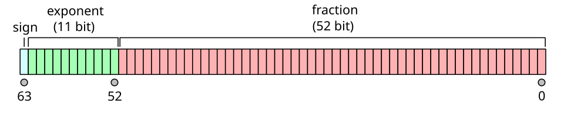

# DoubleInterval

1. Максимальное значение:
$$\text{MAX_VALUE}= 1.7976931348623157\cdot10^{+308}$$
2. Минимальное значение:
3. Минимальное нормальное значение:
   $$\text{MIN_NORMAL}= 2.2250738585072014\cdot10^{-308}$$

### Представление в памяти

### Формула числа
$$(-1)^s\cdot1.m\cdot 2^{e-\text{bias}},$$
где $\text{bias} = 2^{k-1} - 1 $, где $k$ - число бит экспоненты, следовательно, для double $\text{bias} = 2^{10}-1=1023$,
$s$ - бит знака, $m$ - дробная часть мантиссы, $e$ - значение экспоненты.

Итоговая формула имеет вид:
$$(-1)^s\cdot1.m\cdot 2^{e-1023}$$

Bias используется для представления отрицательной экспоненты, так как изначально она хранится в виде беззнакового числа 
имея диапазон $[0, 2047] $, но $0$ используется для Subnormal numbers, а $2047$ — для бесконечности или NaN. Используется для
отрицательной экспоненты, быстрого сравнения и резервирования специальных значений, рассмотренных раннее.

Тогда для получения максимального числа экспонента равна $2046–1023 = 1023$, а значащая часть будет стремиться к 2. 
Тогда само число имеет вид $\approx 2^{1024}$, т.е.
$$\text{MAX_VALUE}= 1.7976931348623157\cdot10^{+308}$$

Для минимального нормального числа сдвинутое значение экспоненты равно $1-1023 = -1022$, мантисса равна $1.0$,
тогда
$$\text{MIN_VALUE}= 2.2250738585072014\cdot10^{-308}$$

И само минимальное число, оно является Subnormal number, так как у мантиссы нет 1, а формула уже имеет вид
$$1^s \cdot 0.m \cdot 2^{-1022}$$
Тогда мантисса будет $0\dots001$, т.е. $2^{–52} $, а экспонента $2^{-1022}$, тогда
$$\text{MIN_VALUE}= 2^{-1074} \approx4.9\cdot10^{-324}$$. Они нужны для плавного приближения к нулю и можно разделить на 
два интервала: $(0, 2^{-1022})$ и $[2^{-1022},2^{1023})$. Шаг первого интервала равен 
$$\Delta = 2^{-1022} $$
А у второго:
$$\Delta = 2^{e-1023 - 52}$$
